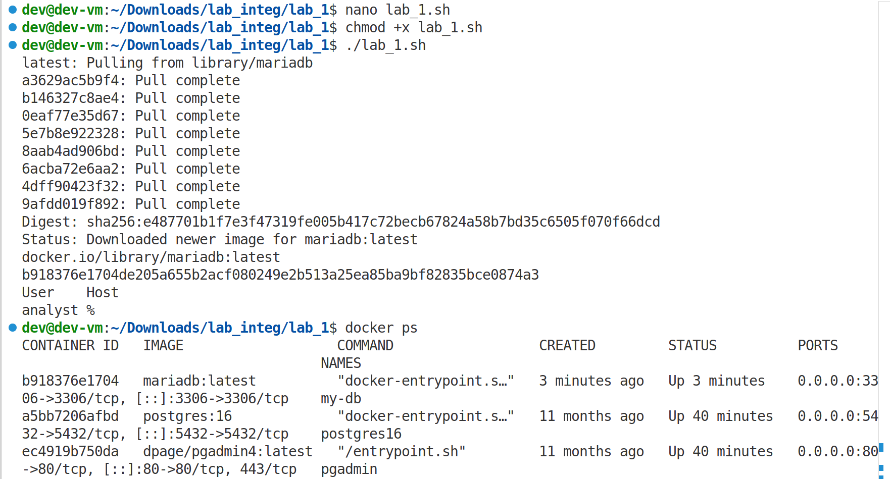

# Отчет по лабораторной работе №1
## Установка и настройка Docker. Работа с контейнерами и образами

### Титульный лист
**ФИО:** [Ваше ФИО]  
**Группа:** [Номер группы]  
**Название работы:** "Освоение Docker: установка, настройка и работа с контейнерами"  
**Вариант:** Реляционная БД (аналог MySQL)  
**Дата выполнения:** 10.02.2026

---

### Цель работы
Освоить процесс установки и настройки Docker, научиться работать с основными командами CLI, контейнерами и образами. Понять принципы контейнеризации для развертывания аналитических сред и сервисов.

---

### Ход выполнения работы

#### Шаг 1. Подготовка среды
- Скачан образ `ETL+devops_26.ova`
- Импортирован в VirtualBox
- Запущена виртуальная машина на базе Ubuntu

#### Шаг 2. Установка Docker
Данный шаг был пропущен, так как в предоставленном образе было установлено всё необходимое.

#### Шаг 3. Проверка установки Docker

**Скриншот 1:** Проверка версии Docker  


```bash
docker --version
```

**Скриншот 2:** Запуск тестового контейнера hello-world  


```bash
docker run hello-world
```

#### Шаг 4. Работа с основными командами Docker CLI

**Скриншот 3:** Просмотр скачанных образов  


```bash
docker images
```

**Скриншот 4:** Просмотр запущенных контейнеров  


```bash
docker ps
```

**Скриншот 5:** Просмотр всех контейнеров  


```bash
docker ps -a
```

---

### Индивидуальное задание: Развертывание MariaDB и создание пользователя analyst

#### Задание
Реляционная БД. Аналог MySQL. Запустить контейнер, установить переменную пароля root, зайти в БД и создать пользователя analyst.

#### Выполнение задания

**1. Создание скрипта для автоматизации**

Создана папка `lab_integ` с файлом `lab_1.sh` со следующим содержанием:

```bash
#!/bin/bash
docker pull mariadb:latest
docker run --name my-db -e MYSQL_ROOT_PASSWORD=root123 -p 3306:3306 -d mariadb:latest
sleep 45
docker exec -i my-db mariadb -u root -proot123 <<EOF
CREATE USER 'analyst'@'%' IDENTIFIED BY 'analyst123';
GRANT ALL PRIVILEGES ON *.* TO 'analyst'@'%';
FLUSH PRIVILEGES;
SELECT User, Host FROM mysql.user WHERE User='analyst';
EOF
```
**Скриншот 6:** Добавление скрипта в NANO


**2. Запуск скрипта**

**Скриншот 7:** Выполнение скрипта  


```bash
chmod +x lab_1.sh
./lab_1.sh
```

**3. Проверка работы контейнера**

**Скриншот 7:** Работающий контейнер MariaDB  


```bash
docker ps
```

**4. Проверка созданного пользователя**

**Скриншот 8:** Подключение под пользователем analyst  


```bash
docker exec -it my-db mariadb -u analyst -p
# Ввод пароля: analyst123
```

**Скриншот 9:** Создание тестовой базы данных  


```sql
CREATE DATABASE test_db;
USE test_db;
CREATE TABLE test_table (id INT, name VARCHAR(50));
INSERT INTO test_table VALUES (1, 'Тестовые данные');
SELECT * FROM test_table;
```

**5. Проверка списка пользователей**

**Скриншот 10:** Список пользователей MariaDB  


```bash
docker exec my-db mariadb -u root -proot123 -e "SELECT User, Host FROM mysql.user;"
```

---

### Выводы

#### Что изучено:
1. Установлен и настроен Docker CE в виртуальной машине Ubuntu
2. Освоены основные команды Docker CLI:
   - `docker pull` - загрузка образов
   - `docker run` - запуск контейнеров
   - `docker ps` - просмотр контейнеров
   - `docker images` - просмотр образов
   - `docker exec` - выполнение команд в контейнере
3. Изучены принципы работы с переменными окружения в контейнерах
4. Освоена работа с портами при запуске контейнеров
5. Получен практический опыт развертывания реляционной БД в контейнере

#### С какими проблемами столкнулись:
1. **Проблема:** Ошибка "mysql: executable file not found in $PATH" при выполнении команд внутри контейнера  
   **Решение:** Обнаружено, что в образе MariaDB используется клиент `mariadb` вместо `mysql`. Исправлена команда с `mysql` на `mariadb`.

2. **Проблема:** Недостаточное время ожидания при запуске контейнера  
   **Решение:** Увеличен интервал `sleep` с 15 до 45 секунд для полной инициализации MariaDB.

3. **Проблема:** Ошибки синтаксиса SQL со стороны исполнителя лаборатоной работы (то есть меня) при создании базы данных  
   **Решение:** Исправлены опечатки в командах SQL:
   - `CREATE DATABASES` → `CREATE DATABASE`
   - `test db` → `test_db`
   - `is INT` → `id INT`

#### Итоги:
Лабораторная работа успешно выполнена. Установлен Docker, освоены основные команды для работы с контейнерами. Запущен контейнер с MariaDB, создан пользователь `analyst` с полными привилегиями. Принципы контейнеризации изучены на практике, что позволит в дальнейшем эффективно развертывать аналитические среды и сервисы.

---

### Приложения
- [Скрипт lab_1.sh](lab_1.sh)
- [Все скриншоты в папке img/](img/)
