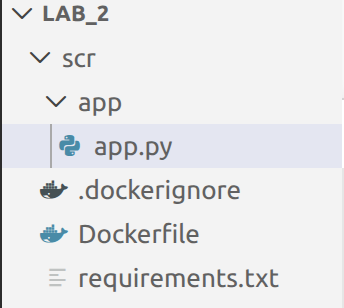
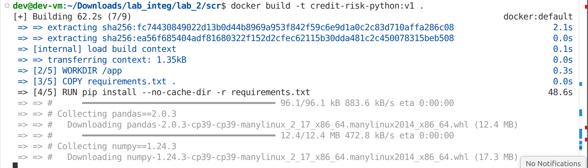
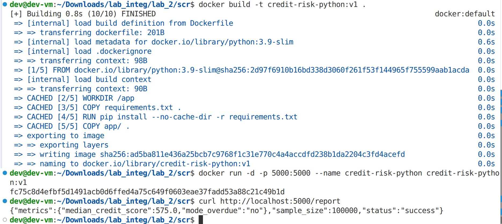
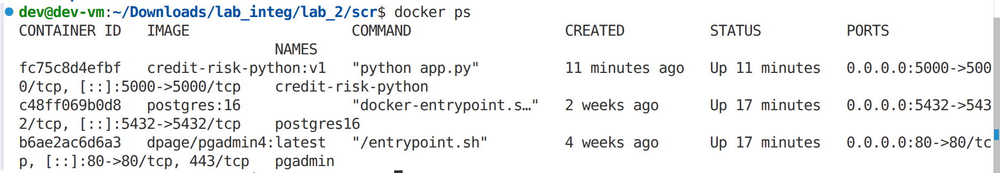
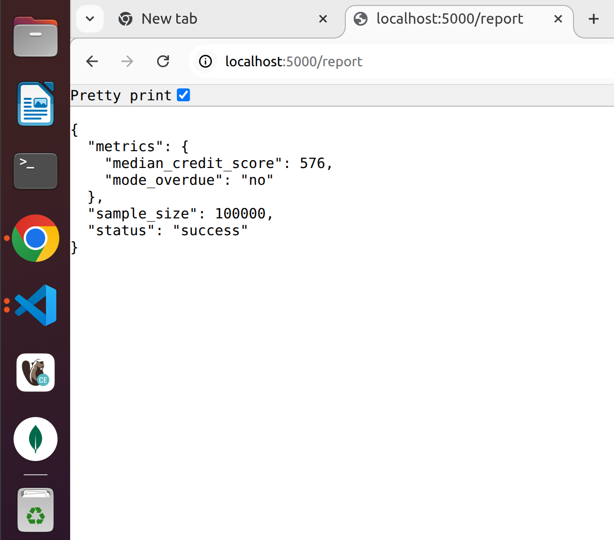
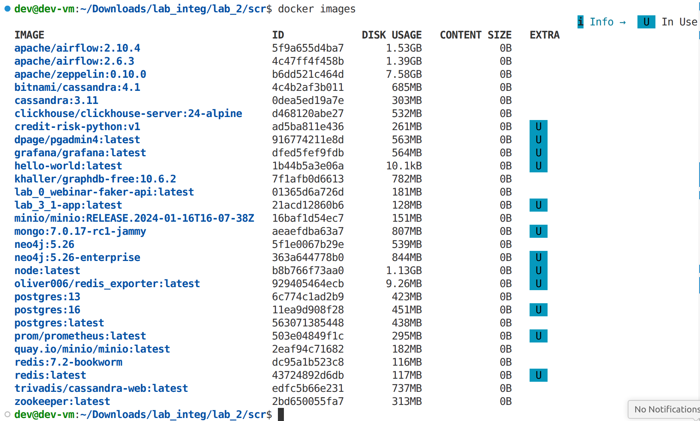

# Лабораторная работа 2.1. Создание Dockerfile и сборка образа

**Вариант:** 16  
**Тема данных:** Кредитный риск (Credit Risk)  

---

## 1. Описание задачи

Требуется разработать воспроизводимый аналитический инструмент, который генерирует набор данных о кредитных рисках клиентов и вычисляет ключевые статистические метрики: медиану кредитного рейтинга и моду наличия просрочек.

**Бизнес-метрики:**
- **Медиана кредитного рейтинга** — устойчивая мера центральной тенденции, менее чувствительная к выбросам, чем среднее.
- **Мода просрочек** — наиболее часто встречающееся значение поля `overdue` (есть/нет просрочки), позволяющее оценить типичный риск клиента.

**Данные:** генерируются синтетически в момент запроса. Каждая запись содержит:
- `client_id` – идентификатор
- `credit_score` – кредитный рейтинг (от 300 до 850)
- `income` – доход (от 20 000 до 200 000)
- `debt` – долг (от 0 до 100 000)
- `overdue` – наличие просрочки (`yes` с вероятностью 30%, `no` с 70%)

Объём выборки: 100 000 записей, что позволяет получить репрезентативные статистические показатели.

---

## 2. Листинг кода

### Путь файлов
  

```
scr/
├── app/
│   └── app.py
├── requirements.txt
└── Dockerfile
```

### 2.1 Аналитический сервис (`scr/app.py`)
[app.py](app.py)

```python
from flask import Flask, jsonify
import pandas as pd
import numpy as np

app = Flask(__name__)

def generate_data(n=100000):
    """Генерирует синтетические данные о кредитных рисках (100 000 записей)"""
    data = {
        'client_id': range(1, n+1),
        'credit_score': np.random.randint(300, 851, n),
        'income': np.random.randint(20000, 200001, n),
        'debt': np.random.randint(0, 100001, n),
        'overdue': np.random.choice(['yes', 'no'], n, p=[0.3, 0.7])
    }
    return pd.DataFrame(data)

@app.route('/report')
def get_report():
    df = generate_data()
    median_credit_score = df['credit_score'].median()
    mode_overdue = df['overdue'].mode()[0]
    return jsonify({
        "status": "success",
        "metrics": {
            "median_credit_score": float(median_credit_score),
            "mode_overdue": mode_overdue
        },
        "sample_size": len(df)
    })

if __name__ == '__main__':
    app.run(host='0.0.0.0', port=5000)
```

### 2.2 Зависимости (`requirements.txt`)
[requirements.txt](requirements.txt)

```
Flask==2.3.3
pandas==2.0.3
numpy==1.24.3
```

### 2.3 Dockerfile
[Dockerfile](Dockerfile)

```dockerfile
FROM python:3.9-slim

WORKDIR /app

COPY requirements.txt .
RUN pip install --no-cache-dir -r requirements.txt

COPY app/ .

EXPOSE 5000

CMD ["python", "app.py"]
```

### 2.4 `.dockerignore`

```
__pycache__
*.pyc
.git
.gitignore
README.md
*.md
.DS_Store
```

---

## 3. Инструкция по сборке и запуску

1. **Собрать образ**  
   ```bash
   docker build -t credit-risk-python:v1 .
   ```

2. **Запустить контейнер**  
   ```bash
   docker run -d -p 5000:5000 --name credit-risk-python credit-risk-python:v1
   ```

3. **Проверить работу**  
   ```bash
   curl http://localhost:5000/report
   ```

---

## 4. Скриншоты

### 4.1 Сборка образа
  

*из-за внезапной перезагрузки ноутбука - был перезапуск процессов* 
  

### 4.2 Запуск контейнера
  

### 4.3 Результат работы API
  

### 4.4 Docker images
  


