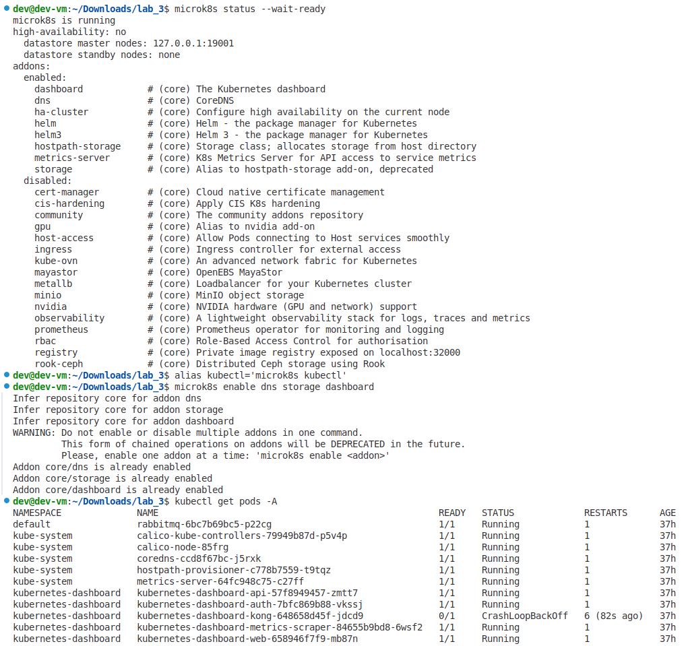
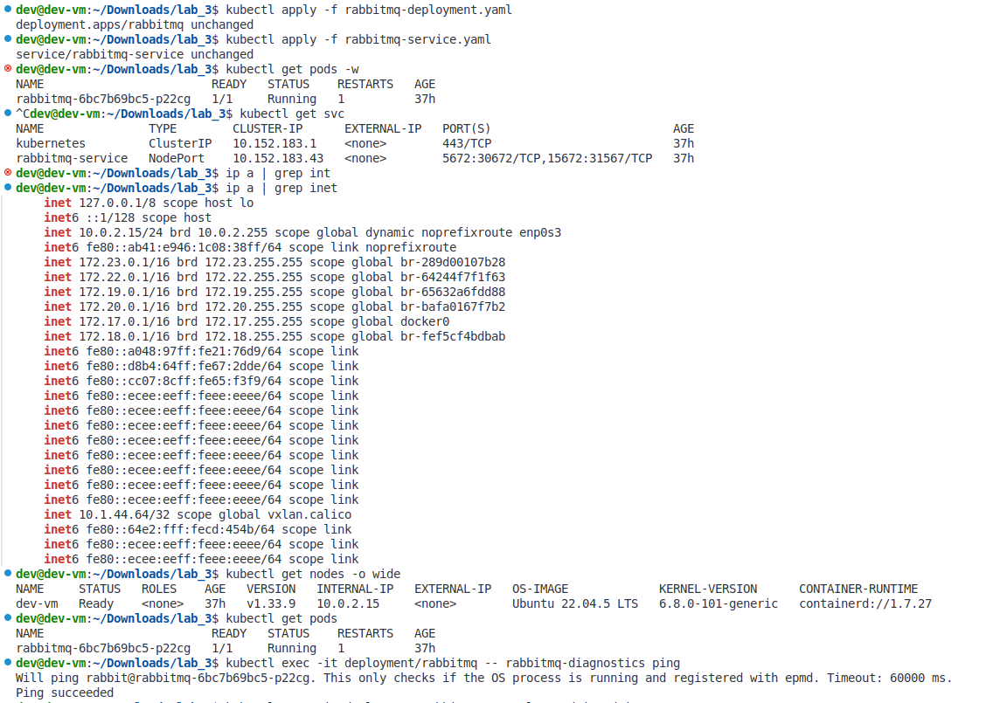
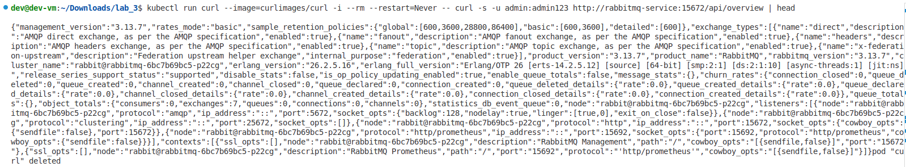
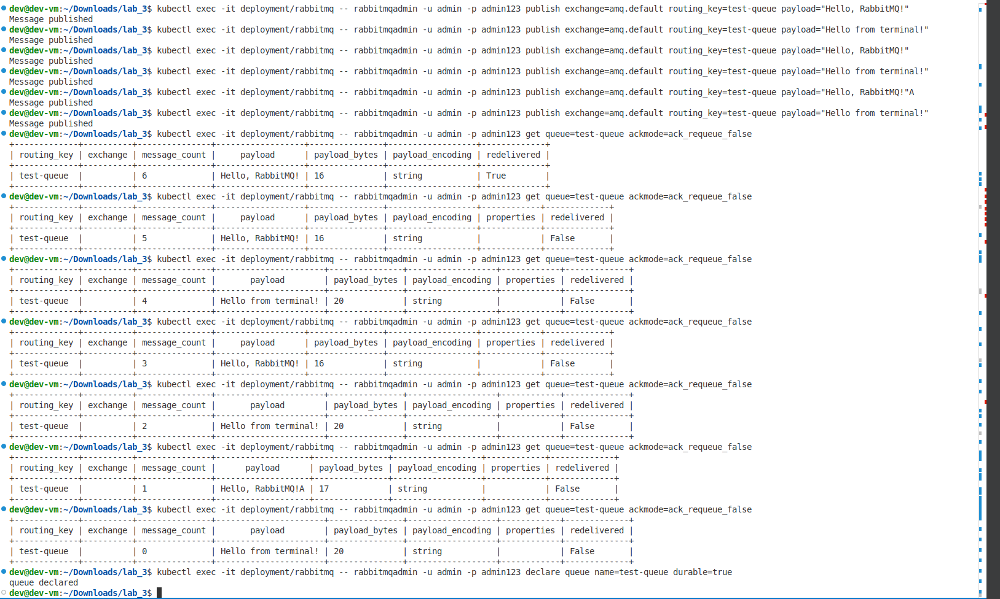
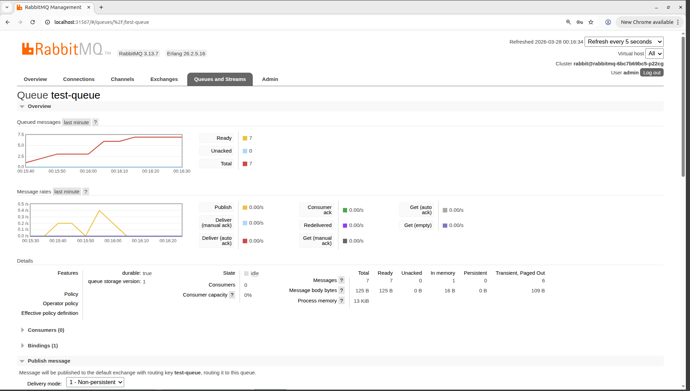
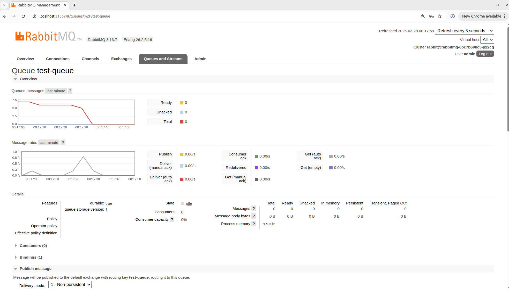

# Лабораторная работа 3.1. Развертывание приложения в Kubernetes
 
**Вариант:** 16  
**Задача:** Развернуть брокер сообщений RabbitMQ с плагином управления (Management Plugin) и открыть порт 15672 для доступа к веб-панели управления очередями.

---

## Цель работы
Освоить процесс оркестрации контейнеров, научиться разворачивать связки сервисов в кластере Kubernetes, управлять масштабированием (Deployment) и сетевой доступностью (Service). В рамках варианта необходимо развернуть RabbitMQ, обеспечить его работу и доступ к веб-интерфейсу управления.

---

## Ход выполнения

### 1. Создание манифестов

Для развертывания RabbitMQ использованы два YAML-файла: `rabbitmq-deployment.yaml` (описание приложения) и `rabbitmq-service.yaml` (открытие доступа).

#### 1.1. Deployment – `rabbitmq-deployment.yaml`
```yaml
apiVersion: apps/v1
kind: Deployment
metadata:
  name: rabbitmq
  labels:
    app: rabbitmq
spec:
  replicas: 1
  selector:
    matchLabels:
      app: rabbitmq
  template:
    metadata:
      labels:
        app: rabbitmq
    spec:
      containers:
      - name: rabbitmq
        image: rabbitmq:3.13-management
        ports:
        - containerPort: 5672
        - containerPort: 15672
        env:
        - name: RABBITMQ_DEFAULT_USER
          value: "admin"
        - name: RABBITMQ_DEFAULT_PASS
          value: "admin123"
        resources:
          limits:
            memory: "512Mi"
            cpu: "500m"
```
**Пояснения:**
- `image: rabbitmq:3.13-management` – используется официальный образ, в который уже включён плагин управления. Благодаря этому веб-панель доступна сразу после запуска.
- `containerPort: 15672` – порт, на котором работает веб-интерфейс. Задание требует открыть именно этот порт.
- Переменные окружения задают учётные данные для входа в веб-панель.

#### 1.2. Service – `rabbitmq-service.yaml`
```yaml
apiVersion: v1
kind: Service
metadata:
  name: rabbitmq-service
spec:
  selector:
    app: rabbitmq
  type: NodePort
  ports:
  - name: amqp
    port: 5672
    targetPort: 5672
    nodePort: 30672
  - name: management
    port: 15672
    targetPort: 15672
    nodePort: 31567
```
**Пояснения:**
- `type: NodePort` – открывает доступ к сервису снаружи кластера через статический порт на узлах.
- `nodePort: 31567` – порт на узле, по которому будет доступна веб-панель. Kubernetes ограничивает диапазон NodePort значениями 30000–32767, поэтому выбран порт 31567. Внутренний порт контейнера остаётся стандартным (15672).
- `selector` связывает сервис с подами, имеющими метку `app: rabbitmq`.

### 2. Развертывание в кластере

Кластер запущен на виртуальной машине с Ubuntu 22.04 под управлением MicroK8s. Для удобства установлен алиас `alias kubectl='microk8s kubectl'`.


Применяем манифесты:
```bash
kubectl apply -f rabbitmq-deployment.yaml
kubectl apply -f rabbitmq-service.yaml
```

Проверяем состояние подов и сервисов:

```bash
kubectl get pods
```
```bash
kubectl get services
```


На скриншотах видно, что под `rabbitmq-*` находится в статусе `Running`, а сервис `rabbitmq-service` имеет тип `NodePort` и порт `31567`.



### 3. Проверка доступности веб-интерфейса

Для доступа к веб-панели используется `kubectl port-forward`, так как виртуальная машина находится в сети NAT.  
Выполняем:
```bash
kubectl port-forward service/rabbitmq-service 15672:15672
```
После этого веб-интерфейс становится доступен на локальной машине по адресу `http://localhost:15672`.  
Вводим учётные данные: `admin` / `admin123`.

#### 3.1. Создание очереди
Переходим в раздел **Queues**, нажимаем **Add a new queue**.  
Задаём имя `test-queue`, выбираем **Durable**, остальное оставляем по умолчанию.  

#### 3.2. Публикация сообщения
На странице очереди `test-queue` находим блок **Publish message**.  
В поле **Payload** вводим `Hello, RabbitMQ!` и нажимаем **Publish message**.  

#### 3.3. Получение сообщения
В том же окне, в блоке **Get messages**, нажимаем **Get Message(s)**.  
Видим полученное сообщение:  

### 4. Дополнительная проверка через терминал

Для подтверждения работоспособности можно использовать встроенную утилиту `rabbitmqadmin`. Выполняем команды прямо из пода:

```bash
# Создание очереди (если ещё не создана)
kubectl exec -it deployment/rabbitmq -- rabbitmqadmin -u admin -p admin123 declare queue name=test-queue durable=true

# Отправка сообщения
kubectl exec -it deployment/rabbitmq -- rabbitmqadmin -u admin -p admin123 publish exchange=amq.default routing_key=test-queue payload="Hello from terminal!"

# Получение сообщения
kubectl exec -it deployment/rabbitmq -- rabbitmqadmin -u admin -p admin123 get queue=test-queue ackmode=ack_requeue_false
```
Результат показывает, что сообщение успешно прошло через брокер.





---

## Выводы

В ходе выполнения лабораторной работы были получены следующие навыки:
- Создание декларативных манифестов Kubernetes (Deployment, Service).
- Развертывание приложения (RabbitMQ) в кластере.
- Открытие доступа к приложению с помощью NodePort и проброса портов.
- Проверка работоспособности через веб-интерфейс и утилиты командной строки.

**Трудности:**
- Настройка доступа к веб-интерфейсу из-за использования NAT в виртуальной машине. Проблема решена с помощью `kubectl port-forward`.
- Освоение синтаксиса YAML и понимание взаимосвязи между Deployment, Service и Pod.

**Роль Kubernetes:**
- Kubernetes позволяет легко управлять жизненным циклом приложения (запуск, масштабирование, обновление).
- Сервисы обеспечивают сетевую доступность и балансировку нагрузки.
- Декларативный подход упрощает воспроизводимость инфраструктуры.

Развернутая система соответствует заданию: RabbitMQ с Management Plugin работает, порт 15672 открыт для доступа к веб-панели управления очередями.

---

## Ссылки на файлы в репозитории

- [Манифест Deployment](rabbitmq-deployment.yaml)
- [Манифест Service](rabbitmq-service.yaml)

