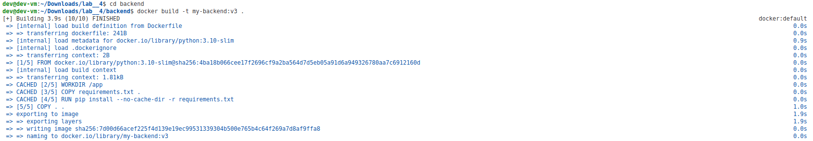
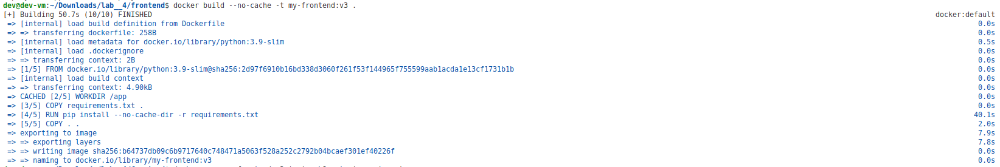
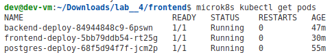
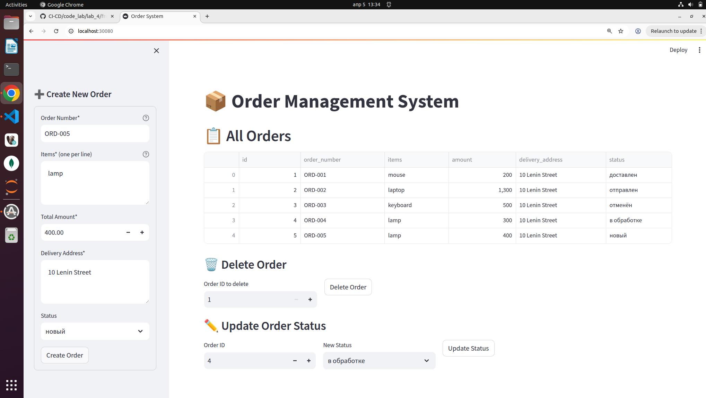
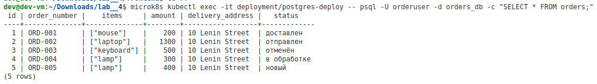
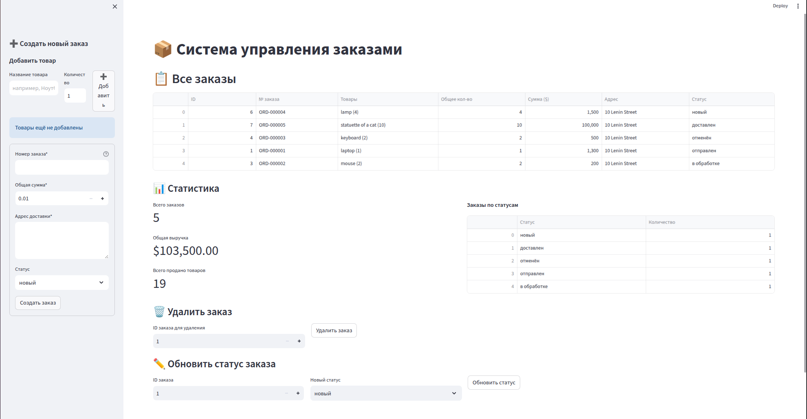
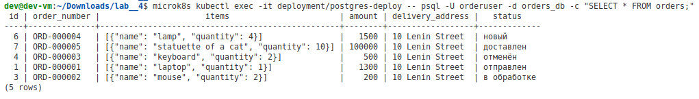

# Лабораторная работа №4.1 Создание и развертывание полнофункционального приложения в Kubernetes

|Вариант|Название системы|Бизнес-задача|Данные (Пример)|
|--------|-------------------|--------------|------------------|
|16|Order System|Управление заказами клиентов.|Номер заказа, список товаров, сумма, адрес доставки.|

## 1. Титульный лист

- **Дисциплина:** Интеграция и развертывание программного обеспечения с помощью контейнеров (Docker и Kubernetes)  
- **Тема:** Трёхзвенное приложение (Frontend + Backend + Database) в Kubernetes  
- **Технологический стек:** Python, FastAPI, Streamlit, PostgreSQL, Docker, MicroK8s, kubectl  
- **Цель:** Применить знания по контейнеризации и оркестрации, настроить взаимодействие микросервисов.


## 2. Описание архитектуры

Приложение реализует **управление заказами клиентов** (CRUD + дополнительное поле «статус»).  
Состоит из трёх независимых сервисов:

| Компонент   | Технология       | Роль                                                                 |
|-------------|------------------|----------------------------------------------------------------------|
| **Backend** | FastAPI + SQLAlchemy | REST API (CRUD), валидация данных, бизнес-логика                     |
| **Frontend**| Streamlit        | Пользовательский интерфейс: форма создания, таблица заказов, удаление, обновление статуса |
| **Database**| PostgreSQL 13    | Хранение заказов (поля: id, order_number, items(JSON), amount, delivery_address, status) |

### Взаимодействие сервисов

- Frontend обращается к Backend через HTTP по имени `backend-service:8000` (K8s Service).
- Backend подключается к PostgreSQL по имени `postgres-service:5432`.
- Все сервисы запущены в одном namespace `default` кластера MicroK8s.
- Для доступа из браузера используется NodePort `30080` на Frontend.

### Дополнительно реализовано

По собственной инициативе добавлено поле **«статус заказа»** (`status`), что позволило:
- Расширить бизнес-логику (новый, в обработке, отправлен, доставлен, отменён).
- Добавить возможность обновления статуса через интерфейс.
- Продемонстрировать работу с обновлением (PUT) и расширением схемы БД.

---

## 3. Структура проекта

```
code_lab/lab_4/
├── backend/
│   ├── Dockerfile
│   ├── requirements.txt
│   ├── main.py
│   ├── database.py
│   ├── models.py
│   ├── schemas.py
│   └── crud.py
├── frontend/
│   ├── Dockerfile
│   ├── requirements.txt
│   └── app.py
└── k8s/
    └── fullstack.yaml
```

## 4. Листинги кода (основные файлы)

### 4.1 Backend – `backend/main.py` (сокращённо)

```python
from fastapi import FastAPI, Depends, HTTPException, status
from sqlalchemy.orm import Session
from typing import List
from database import SessionLocal, engine, Base
from schemas import OrderCreate, OrderUpdate, OrderResponse
import crud

Base.metadata.create_all(bind=engine)
app = FastAPI(title="Order System API")

def get_db():
    db = SessionLocal()
    try:
        yield db
    finally:
        db.close()

@app.post("/orders", response_model=OrderResponse, status_code=201)
def create_order(order: OrderCreate, db: Session = Depends(get_db)):
    if crud.get_order_by_number(db, order.order_number):
        raise HTTPException(400, "Order number already exists")
    return crud.create_order(db, order)

@app.get("/orders", response_model=List[OrderResponse])
def list_orders(skip: int = 0, limit: int = 100, db: Session = Depends(get_db)):
    return crud.get_orders(db, skip=skip, limit=limit)

@app.put("/orders/{order_id}", response_model=OrderResponse)
def update_order(order_id: int, order_update: OrderUpdate, db: Session = Depends(get_db)):
    db_order = crud.update_order(db, order_id, order_update)
    if not db_order:
        raise HTTPException(404, "Order not found")
    return db_order

@app.delete("/orders/{order_id}", status_code=204)
def delete_order(order_id: int, db: Session = Depends(get_db)):
    if not crud.delete_order(db, order_id):
        raise HTTPException(404, "Order not found")
```

### 4.2 Frontend – `frontend/app.py` (фрагмент с формой и статусом)

```python
import streamlit as st
import requests
import pandas as pd
import os

BACKEND_URL = os.getenv("BACKEND_URL", "http://backend-service:8000")
status_options = ['новый', 'в обработке', 'отправлен', 'доставлен', 'отменён']

# Форма создания заказа
with st.sidebar:
    with st.form("create_order_form"):
        order_number = st.text_input("Order Number*")
        items = st.text_area("Items* (one per line)")
        amount = st.number_input("Total Amount*", min_value=0.01)
        address = st.text_area("Delivery Address*")
        status = st.selectbox("Status", status_options)
        submitted = st.form_submit_button("Create Order")
        if submitted:
            payload = { "order_number": order_number, "items": items_list,
                        "amount": amount, "delivery_address": address, "status": status }
            requests.post(f"{BACKEND_URL}/orders", json=payload)

# Отображение таблицы и обновление статуса
orders = fetch_orders()
if orders:
    df = pd.DataFrame(orders)
    df['items'] = df['items'].apply(lambda x: ", ".join(x))
    st.dataframe(df[['id','order_number','items','amount','delivery_address','status']])
    
    # Обновление статуса
    update_id = st.number_input("Order ID", key="upd_id")
    new_status = st.selectbox("New Status", status_options, key="new_st")
    if st.button("Update Status"):
        requests.put(f"{BACKEND_URL}/orders/{update_id}", json={"status": new_status})
```

### 4.3 Dockerfile (Backend)

```dockerfile
FROM python:3.9-slim
WORKDIR /app
COPY requirements.txt .
RUN pip install --no-cache-dir -r requirements.txt
COPY . .
CMD ["uvicorn", "main:app", "--host", "0.0.0.0", "--port", "8000"]
```

### 4.4 Kubernetes манифест – `k8s/fullstack.yaml` (фрагменты)

```yaml
# PostgreSQL Deployment + Service
apiVersion: apps/v1
kind: Deployment
metadata:
  name: postgres-deploy
spec:
  replicas: 1
  selector:
    matchLabels:
      app: postgres
  template:
    metadata:
      labels:
        app: postgres
    spec:
      containers:
      - name: postgres
        image: postgres:13
        env:
        - name: POSTGRES_USER
          value: "orderuser"
        - name: POSTGRES_PASSWORD
          value: "orderpass"
        - name: POSTGRES_DB
          value: "orders_db"
---
apiVersion: v1
kind: Service
metadata:
  name: postgres-service
spec:
  selector:
    app: postgres
  ports:
    - port: 5432

# Backend Deployment + Service (аналогично, image: my-backend:v3)
# Frontend Deployment + Service (type: NodePort, nodePort: 30080)
```


## 5. Трудности и их преодоление

В ходе выполнения работы возникло несколько **нетривиальных технических проблем**, которые были успешно решены.

### 5.1 Несовместимость синтаксиса Python 3.10+ с образом 3.9

**Проблема:**  
В коде использовался синтаксис объединения типов `str | None`, который появился в Python 3.10. Однако в `Dockerfile` был указан базовый образ `python:3.9-slim`. При запуске контейнера бэкенд падал с ошибкой:
```
TypeError: unsupported operand type(s) for |: 'type' and 'NoneType'
```

**Решение:**  
Был переписан `schemas.py` с заменой `str | None` на `Optional[str]` (из `typing`), а `list[str]` на `List[str]`. Это обеспечило совместимость с Python 3.9.

### 5.2 Импорт локальных Docker-образов в MicroK8s

**Проблема:**  
Образы `my-backend:v2` и `my-frontend:v2` были собраны в Docker, но Kubernetes (containerd) не мог их найти – поды переходили в состояние `ImagePullBackOff`.

**Решение:**  
Вместо `docker push` (нет реестра) использовали двухэтапный импорт:
```bash
docker save my-backend:v2 | microk8s ctr image import -
docker save my-frontend:v2 | microk8s ctr image import -
```
При этом важно было избежать промежуточных tar-файлов из-за нехватки места на диске (использован прямой pipe).

### 5.3 Отсутствие Kubernetes Services для БД и бэкенда

**Проблема:**  
При проверке `kubectl get svc` обнаружилось, что сервисы `postgres-service` и `backend-service` не создались, хотя были прописаны в `fullstack.yaml`. Причина – синтаксическая ошибка в YAML (отсутствие разделителя `---` перед сервисами). В результате бэкенд не мог разрешить DNS-имена и падал с ошибкой:
```
could not translate host name "postgres-service" to address
```

**Решение:**  
Сервисы были созданы вручную через `kubectl expose`:
```bash
microk8s kubectl expose deployment postgres-deploy --port=5432 --target-port=5432 --name=postgres-service
microk8s kubectl expose deployment backend-deploy --port=8000 --target-port=8000 --name=backend-service
```
После этого поды бэкенда и фронтенда успешно нашли друг друга.

### 5.4 Сбой сетевого плагина Calico

**Проблема:**  
Поды зависали в состоянии `ContainerCreating` с ошибкой:
```
plugin type="calico" failed (add): error getting ClusterInformation: connection is unauthorized: Unauthorized
```

**Решение:**  
Перезапуск пода Calico в пространстве `kube-system`:
```bash
microk8s kubectl rollout restart daemonset calico-node -n kube-system
microk8s kubectl rollout restart deployment calico-kube-controllers -n kube-system
```
После этого сеть заработала, и поды перешли в `Running`.

### 5.5 Нехватка места на диске при сборке образов

**Проблема:**  
При попытке сохранить образы в tar-файлы возникала ошибка `no space left on device`. Диск виртуальной машины (68 ГБ) был заполнен на 58%, но свободного места оказалось недостаточно из-за кэша Docker и старых образов.

**Решение:**  
Очистка Docker и MicroK8s:
```bash
docker system prune -a -f
microk8s ctr image list | grep -v k8s | xargs -r microk8s ctr image rm
```
А также была использована прямая передача через pipe (избегая создания больших временных файлов).

### 5.6 Добавление поля «статус» (сверх требований)

Хотя по заданию требовались только базовые поля, было решено расширить функциональность для более реалистичного использования. Это потребовало:
- Добавления колонки `status` в модель `models.py` и в схему `schemas.py`.
- Выполнения миграции БД (без потери данных):
  ```sql
  ALTER TABLE orders ADD COLUMN status VARCHAR(50) DEFAULT 'новый';
  ```
- Модификации интерфейса: выбор статуса при создании, отображение в таблице, отдельная форма для обновления статуса через PUT-запрос.
- Пересборки образов с тегом `v3` и обновления деплойментов.

Этот опыт показал, как легко расширять приложение без остановки работы кластера.

---

## 6. Последовательность команд для развёртывания

Ниже приведён итоговый порядок действий, который привёл к работающему приложению.

```bash
# 1. Очистка предыдущих ресурсов
microk8s kubectl delete deployment --all
microk8s kubectl delete svc backend-service frontend-service postgres-service

# 2. Сборка образов с тегом v3 (исправленный код + статус)
cd backend
docker build -t my-backend:v3 .
cd ../frontend
docker build -t my-frontend:v3 .

# 3. Импорт образов в MicroK8s
docker save my-backend:v3 | microk8s ctr image import -
docker save my-frontend:v3 | microk8s ctr image import -

# 4. Применение манифеста (после исправления синтаксиса YAML)
cd ../k8s
microk8s kubectl apply -f fullstack.yaml

# 5. Ручное создание отсутствующих сервисов
microk8s kubectl expose deployment postgres-deploy --port=5432 --target-port=5432 --name=postgres-service
microk8s kubectl expose deployment backend-deploy --port=8000 --target-port=8000 --name=backend-service

# 6. Проверка статуса подов
microk8s kubectl get pods -w

# 7. Добавление колонки status в существующую БД (если не пересоздавали под)
microk8s kubectl exec -it deployment/postgres-deploy -- psql -U orderuser -d orders_db -c "ALTER TABLE orders ADD COLUMN status VARCHAR(50) DEFAULT 'новый';"

# 8. Обновление образов в деплойментах
microk8s kubectl set image deployment/backend-deploy backend=my-backend:v3
microk8s kubectl set image deployment/frontend-deploy frontend=my-frontend:v3

# 9. Доступ к приложению
# Открыть в браузере http://localhost:30080
```

---

## 7. Скриншоты

### 7.1 Сборка образов

  
*Команда `docker build -t my-backend:v3` успешно выполнена.*

  
*Использован флаг `--no-cache` для принудительного копирования обновлённого кода.*

### 7.2 Статус подов в Kubernetes

  
*Все три пода: postgres-deploy, backend-deploy, frontend-deploy – в состоянии `Running` (1/1).*

### 7.3 Работающее приложение в браузере

  

  

## 8. Местонахождение файлов

Все файлы находся в данном репозитории [lab__4](code_lab/lab_4).

Так же приложен файл [команды в терминале](terminal_lab__4.sh). Неполный из-за прекращения отображения ранее использованных команд некоторое количество строк назад.

На всякий пожарный - [Ctrl+P страницы](OrderSystem.pdf). ~Форма немного съехала при проведение операции сохранения~

## 9. Заключение

В ходе лабораторной работы было создано и развёрнуто в кластере Kubernetes трёхзвенное приложение «Order System».  
Реализованы все обязательные CRUD-операции, а также дополнительная функция управления статусом заказа.  
Приложение работает стабильно, данные сохраняются в PostgreSQL, интерфейс доступен через NodePort.  
Преодолены реальные проблемы, связанные с версиями Python, импортом образов в containerd, настройкой Kubernetes Services и сетевым плагином Calico.

---

# UPD

**UPD-1: Можно добавить суммирование количество заказов и сумму прибыли... но пока это только идея без реализации. Может быть - когда-нибудь в ~ближайшем~ далёком будущем осуществлю при необходимости. А пока это не входит в задание.**

**UPD-2: Можно добавить колонку "Количество товаров". Может стоит реализовать? Так будет как-то выглядеть эстетичнее. По UPD-1 можно вывести небольшую табличку. Точнее 2: "Количество заказов и прибыль" и "Количество заказов по статусу"**

## UPD-3: Реализация дополнительного функционала (сверх требований)

Несмотря на то, что задание этого не требовало, я решила добавить в приложение несколько улучшений, чтобы сделать его более полезным и наглядным:

### Добавленные возможности

1. **Поле «Статус заказа»** (новый, в обработке, отправлен, доставлен, отменён) – добавлено в модель БД, в формы создания и обновления, отображается в таблице.
2. **Колонка «Количество товаров» (Total Qty)** – теперь каждый товар имеет не только название, но и количество. В таблице отображается общее число единиц в заказе.
3. **Блок статистики**:
   - Общее количество заказов.
   - Общая выручка (сумма всех заказов).
   - Общее количество проданных товаров.
   - Распределение заказов по статусам (таблица).
4. **Динамическое добавление товаров в форму** – пользователь может добавить несколько товаров с указанием количества, видеть список добавленного и удалять позиции до отправки заказа.

### Технические изменения

#### Backend

- **`backend/schemas.py`** – добавлена модель `OrderItem` с полями `name` и `quantity`, изменены `OrderCreate` и `OrderUpdate` для приёма списка таких объектов.
- **`backend/crud.py`** – в функцию `create_order` добавлено преобразование `[item.dict() for item in order.items]`, чтобы SQLAlchemy мог сохранить данные в JSON-поле. Аналогично для `update_order`.
- **База данных** – поле `items` осталось типа JSON, но теперь хранит массив объектов вида `{"name": "...", "quantity": N}`. Старые заказы (если были) удалены через пересоздание пода PostgreSQL.

#### Frontend

- **`frontend/app.py`** – полностью переработана форма создания:
  - Добавление товаров вынесено из `st.form` (чтобы избежать ошибок с колбэками).
  - Использован `st.session_state` для хранения списка товаров между обновлениями.
  - Кнопка «➕ Add» добавляет текущий товар в список, отображаемый под полями ввода.
  - При отправке заказа формируется `payload` с `items` как список словарей `{"name": ..., "quantity": ...}`.
- **Отображение таблицы**:
  - Поле `items` преобразуется в строку вида `"мышь (10), клавиатура (2)"`.
  - Добавлена колонка `Total Qty` (сумма количеств всех товаров).
  - Переименованы заголовки на русский язык.
- **Статистика** – вычисляется на основе полученных данных (без дополнительных запросов).

### Новые ошибки и их преодоление

| Ошибка | Причина | Решение |
|--------|---------|---------|
| `Object of type OrderItem is not JSON serializable` | SQLAlchemy не умеет сохранять Pydantic-объекты напрямую | Преобразование `item.dict()` перед записью в БД |
| `With forms, callbacks can only be defined on the st.form_submit_button` | Внутри `st.form` нельзя использовать `st.button(on_click=...)` | Вынес кнопку «Add» за пределы формы, оставив в форме только поля и кнопку отправки |
| `Connection error: Expecting value: line 1 column 1` | Бэкенд возвращал ошибку 500 (из-за JSON-сериализации) | Исправлен `crud.py`, обновлён образ бэкенда |
| Отсутствие колонки `status` в старых заказах | Добавление поля позже | Выполнен ALTER TABLE или пересоздан под PostgreSQL |

### Скриншоты обновлённого приложения




### Команды для пересборки после добавления функционала

```bash
# Бэкенд (v5 – с исправленным crud.py)
cd backend
docker build --no-cache -t my-backend:v5 .
docker save my-backend:v5 | microk8s ctr image import -
microk8s kubectl set image deployment/backend-deploy backend=my-backend:v5

# Фронтенд (v5 – финальная версия с динамическими товарами и статистикой)
cd ../frontend
docker build --no-cache -t my-frontend:v5 .
docker save my-frontend:v5 | microk8s ctr image import -
microk8s kubectl set image deployment/frontend-deploy frontend=my-frontend:v5

# Перезапуск подов (для уверенности)
microk8s kubectl rollout restart deployment/backend-deploy
microk8s kubectl rollout restart deployment/frontend-deploy
```
## Местонахождение файлов

Все обновлённые файлы находся в данном репозитории в папках [`frontend`](code_lab/lab_4/frontend/upd) и [`backend`](code_lab/lab_4/backend/upd). В данных папках находятся файлы, подвергшиеся обновлениям.

На всякий пожарный - [Ctrl+P страницы](UpdOrderSystem.pdf). ~Форма немного съехала при проведение операции сохранения~

### Итог

Все добавленные улучшения успешно работают в кластере Kubernetes. Приложение стало более информативным, удобным и приближенным к реальным бизнес-сценариям. Опыт расширения функциональности показал, как важно предусматривать гибкость структур данных (JSON-поле `items`) и правильно обрабатывать объекты на границе Pydantic ↔ SQLAlchemy.
